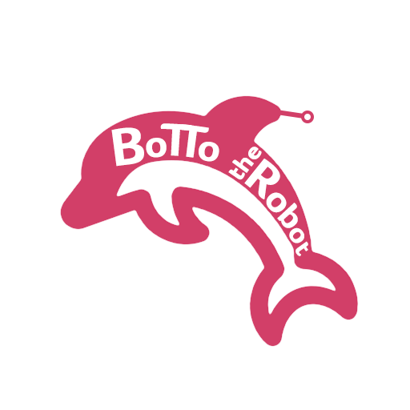

 

# Botto the Robot

Botto is a Discord bot template made to help you build your community from scratch, with the tools you need.

## How it Works

Botto provides useful functions and tools to power-up your Discord bot, totally free. With Botto is possible to:

- Generate roles, channels and it's permissions based on your template with a single command.
- Users are able to get/remove the allowed roles to themselves.
- Add your own code to Botto.

All you need to deal is the hosting. (AWS provides a 12 months free hosting if you need)

## Getting Started

1. Fork and download the Botto Project.
2. Ajust the template file.
3. Setup your bot info on the .env file.
4. Run *npm i* and *npm run commands* on Botto's first execution.
5. Run *npm start* and invite the bot to your Discord server with the link provided on the console.
6. Run the */template* command on any channel of your Discord server.
7. Done!

## Documentation

- [Template Setup](./docs/TEMPLATE_SETUP.md)
- [.env Setup](./docs/ENV_SETUP.md)

## Contributing

### Code of Conduct

Our Code of Conduct is adapted from the Contributor Covenant with some aditions. Make sure to [read it](https://github.com/Katreque/bottotherobot/blob/master/CODE_OF_CONDUCT.md) in order to be part of our Community.

### Contributing Guide

We appreciate any kind of contribution! :3 Read our [contributing guide](https://github.com/Katreque/bottotherobot/blob/master/CONTRIBUTING.md) to learn about our development process, how to propose bugfixes and improvements, and how to build and test your changes to Botto.

## About

Botto was created as a project inside Terê AWS User Group as a way to help other communities to born and grow. If you have any interest in learning about the ideia, share thoughts or want to join the core team, feel free to join our [Discord](https://discord.gg/SD3FtBy).

## License

Botto is [BSD 3-Clause Licensed](https://github.com/Katreque/bottotherobot/blob/master/LICENSE).
